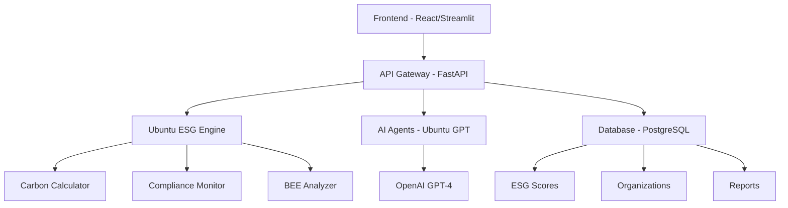

# 🌍 ESGx.Africa

**Africa's First AI-Powered ESG Platform with Ubuntu Philosophy Integration**

*Transforming sustainability compliance through African-built, AI-driven, white-labeled ESG infrastructure.*

[](https://opensource.org/licenses/MIT)
[](https://www.python.org/downloads/)
[](https://fastapi.tiangolo.com)
[](https://streamlit.io)

## 🚀 Vision

To power Africa's sustainable future with a scalable, localized, AI-powered ESG platform for every sector and every region, built on the Ubuntu philosophy: **"I am because we are."**

## 🎯 The Problem We Solve

- **Lack of Localized ESG Infrastructure**: Africa lacks African-built ESG tools and AI systems
- **Expensive Foreign Solutions**: Global ESG systems are costly and often non-compliant with local realities
- **SME Accessibility Gap**: Small and medium enterprises struggle with ESG compliance and data gaps
- **Regulatory Compliance**: Rising ESG requirements across the continent need localized solutions
- **Ubuntu Philosophy Gap**: Current ESG frameworks miss African community-centered values

## 💡 Our Solution

ESGx.Africa is a comprehensive SaaS ESG operating system tailored for Africa's unique needs:

### 🤖 AI-Powered Features
- **Ubuntu GPT Agents**: AI trained on African principles and ESG frameworks
- **Multilingual Support**: English, Afrikaans, Zulu, Xhosa, Swahili, French, Portuguese, Arabic
- **Real-time ESG Scoring**: African-contextualized scoring with Ubuntu Index™
- **Predictive Analytics**: AI-driven risk assessment and opportunity identification

### 🏗️ Core Platform Features
- **Ubuntu Index™**: Unique African philosophy integration score
- **ESG Dashboards**: Real-time scoring and reporting with African context
- **Carbon Accounting**: Linked to African carbon offset markets
- **Compliance Automation**: BEE, JSE, SDG, ISO, TCFD, CSIR frameworks
- **White-label Solutions**: Customizable for enterprises and governments

### 🎓 ESGx Academy
- **Ubuntu ESG Training**: Local talent development in ESG and AI reporting
- **AR/VR Learning**: Immersive 3D dashboard experiences
- **Certification Programs**: African-contextualized ESG credentials

## 📊 Ubuntu Index™

Our proprietary Ubuntu Index™ measures African philosophy integration in ESG practices:

- **Community Engagement** (25%): Local consultation and participation
- **Local Procurement** (20%): Supporting African suppliers and businesses
- **Cultural Preservation** (15%): Protecting heritage and traditions
- **Indigenous Knowledge** (15%): Integrating traditional wisdom
- **Local Employment** (15%): Hiring and training local communities
- **Community Investment** (10%): Revenue percentage invested in communities

## 💰 Subscription Plans

| Plan | Monthly | Annual | Features |
|------|---------|--------|----------|
| **Community Free** | R0 | R0 | Ubuntu Index™, SMS input, 3 reports/month |
| **Ubuntu Starter** | R2,500 | R25,000 | Core ESG KPIs, 1 AI agent, 50 reports/month |
| **Growth Pro** | R15,000 | R150,000 | 2 AI agents, JSE compliance, 500 reports/month |
| **Enterprise ESG** | R75,000 | R750,000 | All AI agents, API access, unlimited reports |
| **Enterprise+** | Custom | Avg R1.5M | On-premise, white-labeling, dedicated support |

## 🚀 Quick Start

### Option 1: Demo (Recommended)
```bash
# Clone the repository
git clone https://github.com/your-org/esgx-africa.git
cd esgx-africa

# Run the quick start script
python start_demo.py
```

### Option 2: Manual Setup
```bash
# Install dependencies
pip install -r requirements.txt

# Run Streamlit demo
streamlit run esgx_africa_demo.py

# Or run FastAPI backend
uvicorn main:app --reload
```

### Option 3: Docker (Coming Soon)
```bash
docker-compose up -d
```

## 🏗️ Architecture



## 📋 Features Roadmap

### ✅ Phase 1 (Current)
- [x] Ubuntu ESG Engine with scoring algorithm
- [x] Streamlit demo with full feature showcase
- [x] Multi-language support framework
- [x] BEE compliance integration
- [x] Carbon accounting module

### 🔄 Phase 2 (Q2 2024)
- [ ] React frontend with modern UI/UX
- [ ] AI agents with OpenAI integration
- [ ] Real-time data connectors
- [ ] JSE compliance automation
- [ ] Mobile app (iOS/Android)

### 🎯 Phase 3 (Q3 2024)
- [ ] AR/VR dashboard experiences
- [ ] Blockchain carbon credit tracking
- [ ] Advanced AI risk prediction
- [ ] Government partnership integrations
- [ ] Multi-tenant white-labeling

### 🌟 Phase 4 (Q4 2024)
- [ ] Pan-African market expansion
- [ ] Indigenous language support
- [ ] Satellite data integration
- [ ] AI-powered audit automation
- [ ] Ubuntu philosophy research platform

## 🛠️ Technology Stack

**Backend:**
- FastAPI (Python) - High-performance async API
- PostgreSQL - Robust data storage
- SQLAlchemy - Database ORM
- Redis - Caching and background tasks
- Celery - Task queue management

**AI & ML:**
- OpenAI GPT-4 - Ubuntu-trained AI agents
- LangChain - AI agent framework
- scikit-learn - ML algorithms
- Pandas/NumPy - Data processing

**Frontend:**
- Streamlit - Rapid prototyping (current demo)
- React - Production frontend (planned)
- Plotly - Data visualizations
- Material-UI - Component library

**Infrastructure:**
- Docker - Containerization
- AWS/Azure - Cloud hosting
- GitHub Actions - CI/CD
- Nginx - Load balancing

## 🌍 African Context Integration

### Regulatory Frameworks
- **BEE (Broad-Based Black Economic Empowerment)** - South Africa
- **JSE Sustainability** - Johannesburg Stock Exchange requirements
- **KING IV** - Corporate governance for South Africa
- **NEMA** - National Environmental Management Act
- **Local Regulations** - Country-specific compliance

### African Languages
- **English** - Primary business language
- **Afrikaans** - South Africa
- **Zulu/Xhosa** - South Africa indigenous languages
- **Swahili** - East Africa lingua franca
- **French** - West/Central Africa
- **Portuguese** - Lusophone Africa
- **Arabic** - North Africa

### Regional Considerations
- **Water Scarcity** - Drought-resilient practices
- **Energy Access** - Off-grid and renewable solutions
- **Community Land Rights** - Indigenous and traditional ownership
- **Cultural Sensitivity** - Ubuntu and traditional values
- **Economic Development** - SME and local business support

## 📊 Sample Ubuntu ESG Score

```python
ubuntu_score = {
    "community_engagement": 85,    # Strong local consultation
    "local_procurement": 62,       # Growing local supplier base
    "cultural_preservation": 78,   # Active heritage support
    "indigenous_knowledge": 45,    # Opportunity for improvement
    "local_employment": 89,        # Excellent local hiring
    "community_investment": 72     # Good revenue reinvestment
}

overall_ubuntu_index = 72.1  # "Ubuntu Advocate" rating
```

## 🤝 Contributing

We welcome contributions from developers, ESG experts, and Ubuntu philosophy advocates!

### Development Setup
1. Fork the repository
2. Create a feature branch (`git checkout -b feature/ubuntu-enhancement`)
3. Make your changes
4. Add tests for new functionality
5. Commit your changes (`git commit -am 'Add Ubuntu feature'`)
6. Push to the branch (`git push origin feature/ubuntu-enhancement`)
7. Create a Pull Request

### Code Standards
- Follow PEP 8 for Python code
- Use type hints for all functions
- Write comprehensive docstrings
- Include Ubuntu philosophy considerations in ESG-related code
- Add tests for new features

## 📖 Documentation

- [API Documentation](http://localhost:8000/api/docs) - Interactive API docs
- [Ubuntu Philosophy Guide](docs/ubuntu-philosophy.md) - Understanding Ubuntu in ESG
- [African ESG Frameworks](docs/african-frameworks.md) - Local compliance guide
- [AI Agent Configuration](docs/ai-agents.md) - Customizing Ubuntu GPT
- [White-label Setup](docs/white-label.md) - Enterprise customization

## 🌟 Use Cases

### 🏭 Mining Companies
- Environmental impact monitoring
- Community engagement tracking
- BEE compliance automation
- Indigenous land rights management

### 🏦 Financial Institutions
- ESG investment screening
- Climate risk assessment
- Sustainable finance reporting
- Community development lending

### 🏛️ Government Agencies
- Policy impact measurement
- Public procurement ESG
- Development program tracking
- Inter-governmental reporting

### 🌱 SMEs & Startups
- Basic ESG compliance
- Investor readiness
- Supply chain verification
- Community impact measurement

## 📧 Support & Contact

- **Website**: [esgx.africa](https://esgx.africa) (coming soon)
- **Email**: hello@esgx.africa
- **LinkedIn**: [ESGx Africa](https://linkedin.com/company/esgx-africa)
- **Twitter**: [@ESGxAfrica](https://twitter.com/ESGxAfrica)

## 📄 License

This project is licensed under the MIT License - see the [LICENSE](LICENSE) file for details.

## 🙏 Acknowledgments

- **Ubuntu Philosophy Council** - For guidance on authentic Ubuntu integration
- **African Development Bank** - For ESG framework insights
- **JSE Limited** - For sustainability reporting standards
- **Pan-African ESG Network** - For regional best practices
- **Open Source Community** - For the incredible tools and libraries

---

**ESGx.Africa™** | *Powered by Ubuntu Philosophy* | *Made for Africa* 🌍

*"Ubuntu tells us that we are interconnected. In ESG terms, this means that the environmental health of our communities, the social wellbeing of our people, and the governance of our institutions are all connected. When we lift up our communities, we lift up ourselves."*